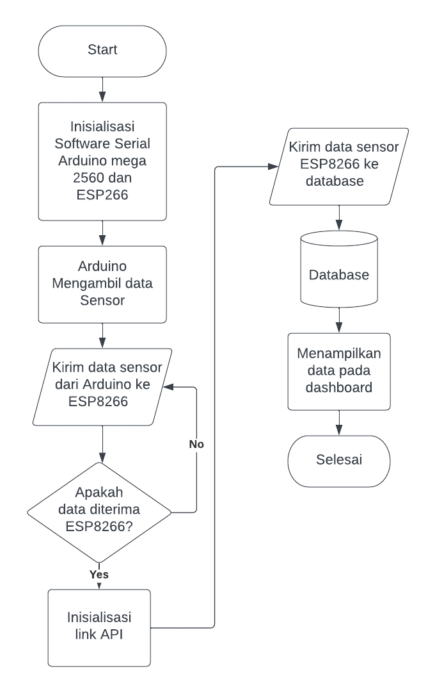
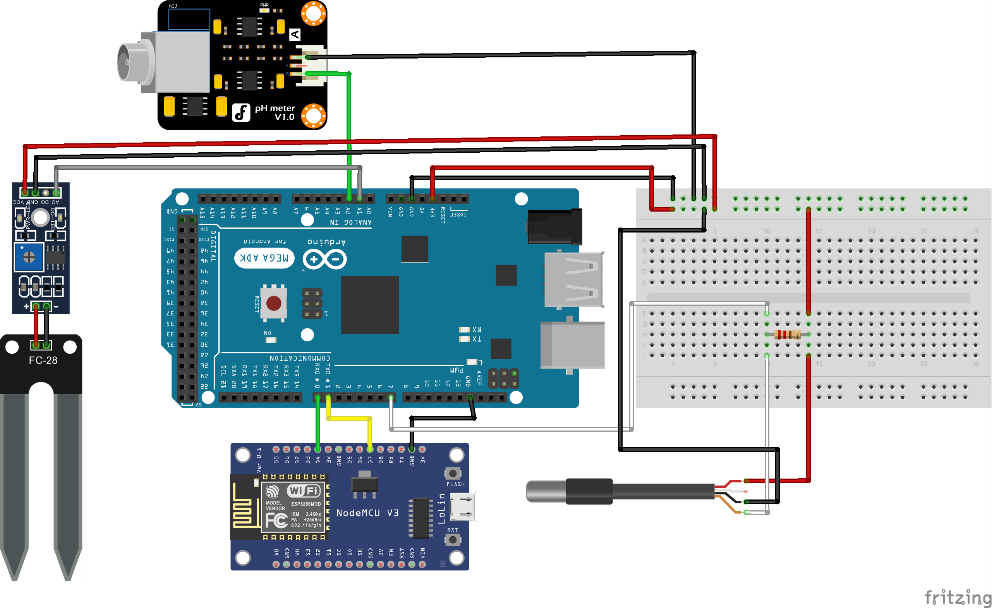
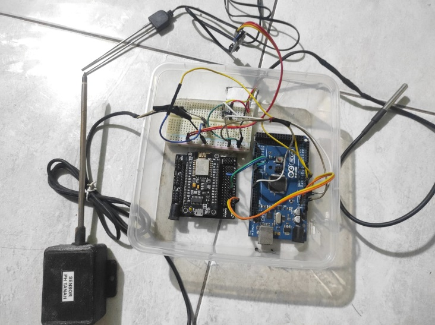
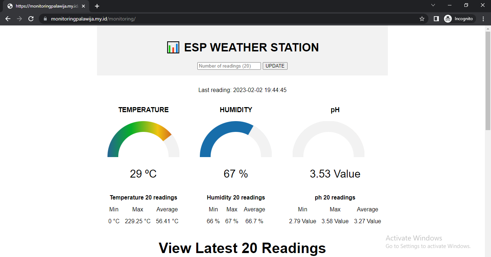

# Sistem Pendeteksi Kandungan Tanah

## Deskripsi Proyek
Proyek ini adalah sistem pendeteksi kandungan tanah yang menggunakan dua mikrokontroler, yaitu ESP8266 dan Arduino Mega. Sistem ini menggabungkan beberapa sensor, termasuk sensor pH, sensor kelembaban tanah, dan sensor suhu DS18B20. Data dari sensor-sensor ini dikumpulkan dan dikirim ke database menggunakan API yang dibuat dengan PHP.

## Flowchart

## Desain Alat

## Hasil Setelah Dirakit

## Dashboard Website

## Penggunaan Mikrokontroler
- Kode untuk Arduino Mega 2560 berada dalam file `main.ino`
- Kode untuk ESP8266 dapat diunggah menggunakan file `sendCode.ino`
- Untuk ESP8266, silahkan isi SSID dan password WiFi yang Anda gunakan, dan sesuaikan alamat server web pada bagian `address` dengan server yang Anda gunakan. Jika menggunakan XAMPP, gantilah dengan `localhost`.

## Konfigurasi API dan Database
- Pada file `esp-database.php`, masukkan nama database (`dbname`), username, dan password database Anda.

Jika ada pertanyaan atau bantuan, jangan ragu untuk menghubungi saya melalui [LinkedIn](https://www.linkedin.com/in/rafik-kusumah).
